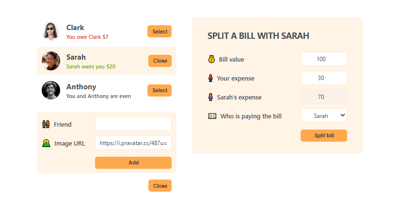

# 🍽️ Split Bill App

A simple **React app** to manage friends and split bills easily. You can add new friends, track balances, and share expenses fairly.

---

## 🚀 Features

- 👥 **Friend List**: View all friends with their profile pictures and balances.
- ➕ **Add Friend**: Add new friends dynamically with name and image.
- 💰 **Split Bills**: Split any bill between you and a selected friend.

- 📊 **Track Balances**:

  - If you owe money → shows in **red**.
  - If your friend owes you → shows in **green**.
  - If balances are settled → shows as **even**.

- 🔄 **Reset selection**: Deselect a friend or close forms anytime.

---

## 🛠️ Tech Stack

- **React** (useState hooks, props, conditional rendering)
- **CSS** for basic styling
- **Pravatar API** for friend avatars

---

## 📂 Project Structure

```
src/
│── App.js # Main component (manages state & logic)
│── index.js # Entry point
│── styles.css # Styles
│
├── Components:
│ ├── FriendList # Renders all friends
│ ├── Friend # Displays single friend with balance
│ ├── FormAddFriend # Form to add new friend
│ ├── FormSplitBill # Form to split bills
│ └── Button # Reusable button component
```
---

## ⚙️ How It Works

1.  **Friend Management**

    - Friends are stored in an array of objects (with `id`, `name`, `image`, `balance`).
    - You can add new friends with a name + avatar URL.

2.  **Selecting a Friend**

    - Clicking **Select** highlights a friend and opens the split bill form.
    - Clicking again on the same friend **deselects** them.

3.  **Splitting Bills**

    - Enter the bill total + your expense.
    - App auto-calculates the friend’s expense.
    - Choose who pays the bill:

      - If **you pay** → your friend’s balance decreases.
      - If **friend pays** → your balance decreases.

4.  **Balances**

    - Positive balance → friend owes you.
    - Negative balance → you owe friend.
    - Zero → even.

---

## 📸 Demo Screenshot

<div align="center">
    
</div>

---

## 🧠 Key React Concepts Used

- **State Management** (`useState`) for handling inputs and balances.
- **Props** to pass data/functions between components.
- **Controlled Inputs** for handling form fields.
- **Conditional Rendering** (e.g., show forms only when needed).
- **Immutability Principle** (updating state with spread operator).
- **Derived State** (friend’s expense auto-calculated from total).

---

## 🔮 Future Improvements

- ✅ Persist friends & balances with **localStorage**.
- ✅ Add option to **edit/delete friends**.
- ✅ Show history of all split bills.
- ✅ Add **responsive design** for mobile view.

---

## 👨‍💻 Author

Developed by **Ramez Khaled** 🚀
